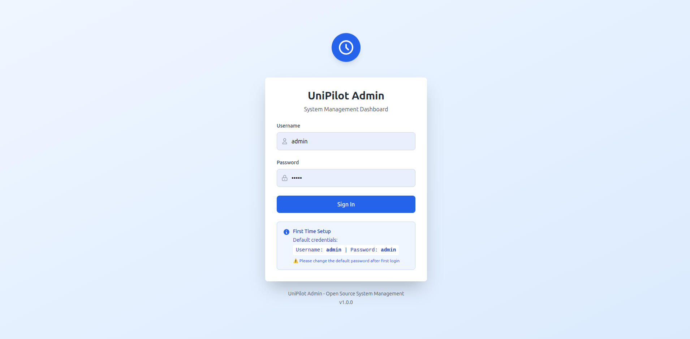
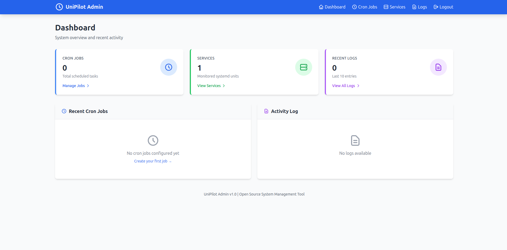
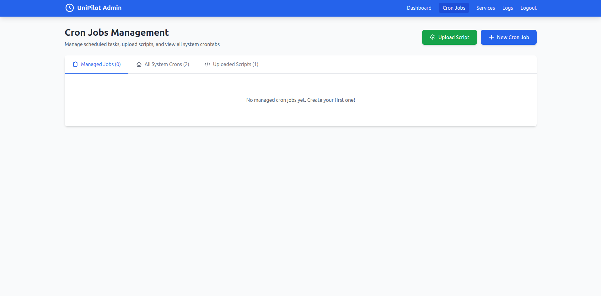

# UniPilot Admin - Enhanced Edition

A powerful, lightweight web application for managing Linux crontab entries and systemd services with **file upload, editing, and complete system crontab viewing**.


## UI Screenshots

### 🔐 Login


### 📊 Dashboard


### ⏰ Cron Management


### ⚙️ Systemd Management


## 🚀 New Features in Enhanced Edition

### 📋 Complete Crontab Management
- **View ALL System Crontabs**: See cron jobs from ALL system users in one place
- **Import Existing Crons**: Automatically import and manage existing crontab entries
- **Multi-User Support**: Manage crontabs for different Linux users

### 📁 Script File Management
- **Upload Scripts**: Upload bash scripts (.sh) directly through web interface
- **View Scripts**: Browse and view script contents in syntax-highlighted viewer
- **Edit Scripts**: Modify scripts with built-in editor
- **Delete Scripts**: Remove uploaded scripts
- **Execute Scripts**: Use uploaded scripts in cron jobs

### ⚙️ Systemd File Management
- **View Unit Files**: Read systemd service file contents
- **Edit Unit Files**: Modify service configurations
- **Create New Services**: Upload custom systemd unit files
- **Auto-Reload**: Automatic daemon-reload after changes

### 🔧 Core Features
- ⏰ **Cron Management**: Create, enable/disable, edit, and run jobs immediately
- 🖥️ **Systemd Control**: Start, stop, and restart services
- 📊 **Structured Logging**: All actions logged as JSON
- 📤 **Log Export**: Export logs in JSON Lines format
- 🔐 **Secure Authentication**: Session-based auth with RBAC
- ⚡ **HTMX-Powered**: Fast, interactive UI without page reloads

## 📦 Installation

### Prerequisites

```bash
# Go 1.21 or higher
go version

# systemd and cron
systemctl --version
crontab -l

# Root or sudo access (required for systemd and crontab management)
```

### Quick Start

1. **Clone or download the files**

2. **Initialize Go module**:
```bash
go mod init github.com/yourusername/unipilot-admin
```

3. **Install dependencies**:
```bash
go get github.com/gorilla/sessions@v1.4.0
go get github.com/mattn/go-sqlite3@v1.14.32
go get gopkg.in/yaml.v3@v3.0.1
go get golang.org/x/crypto@v0.45.0
```

4. **Create directory structure**:
```bash
mkdir -p templates scripts systemd-units
```

5. **Add the files**:
- `main.go` - Main application
- `config.yaml` - Configuration
- `templates/*.html` - HTML templates

6. **Build**:
```bash
go build -o unipilot-admin
```

7. **Run** (requires sudo for systemd/crontab access):
```bash
sudo ./unipilot-admin
```

8. **Access**: Open browser to `http://localhost:8080`
   - Default login: `admin` / `admin`
   - **⚠️ Change immediately after first login!**

## 🎯 Usage Guide

### Managing Cron Jobs

#### View All System Crons
1. Go to **Cron Jobs** page
2. Click **All System Crons** tab
3. See crontabs from ALL users on the system

#### Create a New Cron Job
1. Click **+ New Cron Job**
2. Fill in:
   - **User**: Linux user (e.g., `root`, `www-data`)
   - **Schedule**: Cron expression (e.g., `0 2 * * *`)
   - **Command**: Full path to command/script
   - **Description**: Optional description
3. Click **Create**

#### Upload and Use a Script
1. Click **Upload Script**
2. Select a `.sh` file
3. Script is uploaded to `./scripts/` directory
4. Use the script path in cron job command
5. Example: `/path/to/scripts/backup.sh`

#### Edit Existing Job
1. Click **Edit** icon (pencil) on any job
2. Modify schedule, command, or description
3. Click **Save Changes**

### Managing Scripts

#### View Uploaded Scripts
1. Go to **Cron Jobs** → **Uploaded Scripts** tab
2. See all uploaded bash scripts

#### View Script Contents
1. Click **View** on any script
2. View syntax-highlighted content

#### Edit Script
1. Click **Edit** on any script
2. Modify content in editor
3. Save changes

### Managing Systemd Services

#### View Service Details
1. Go to **Services** page
2. See all services (filtered by config)

#### View Unit File
1. Click **View** icon (eye) on any service
2. See the complete unit file contents

#### Edit Unit File
1. Click **Edit** icon (pencil) on any service
2. Modify unit file content
3. Save (requires root permissions)
4. Systemd automatically reloads

#### Control Services
- **Start**: Start a stopped service
- **Stop**: Stop a running service  
- **Restart**: Restart a service (useful after config changes)

## ⚙️ Configuration

### config.yaml

```yaml
# Database
db_path: "./unitpilot.db"

# Server
listen_addr: ":8080"

# Security (CHANGE THIS!)
session_secret: "your-random-64-char-string"

# Service filters (empty = show all)
systemd_prefixes:
  - "nginx"
  - "postgresql"
  - "redis"

# File directories
scripts_dir: "./scripts"
systemd_dir: "./systemd-units"

# Optional log export
log_export_url: ""
```

### Generate Secure Session Secret
```bash
openssl rand -base64 32
```

## 🔐 Security Best Practices

1. **Change Default Password**: Immediately after first login
2. **Use HTTPS**: Run behind reverse proxy (Nginx/Caddy)
3. **Restrict Network Access**: Use firewall rules
4. **Strong Session Secret**: Use 64+ random characters
5. **Regular Backups**: Backup SQLite database
6. **Monitor Logs**: Review activity logs regularly

## 🌐 Production Deployment

### Systemd Service

Create `/etc/systemd/system/unipilot-admin.service`:

```ini
[Unit]
Description=UniPilot Admin
After=network.target

[Service]
Type=simple
User=root
WorkingDirectory=/opt/unipilot-admin
ExecStart=/opt/unipilot-admin/unipilot-admin
Restart=on-failure
RestartSec=5s

[Install]
WantedBy=multi-user.target
```

Enable and start:
```bash
sudo systemctl daemon-reload
sudo systemctl enable unipilot-admin
sudo systemctl start unipilot-admin
```

### Reverse Proxy (Nginx)

```nginx
server {
    listen 80;
    server_name unipilot.example.com;

    location / {
        proxy_pass http://localhost:8080;
        proxy_set_header Host $host;
        proxy_set_header X-Real-IP $remote_addr;
    }
}
```

### Reverse Proxy (Caddy)

```caddy
unipilot.example.com {
    reverse_proxy localhost:8080
}
```

## 📊 API Endpoints

### Cron Management
- `GET /cron` - List managed jobs
- `POST /cron/create` - Create new job
- `POST /cron/edit` - Edit existing job
- `POST /cron/toggle` - Enable/disable job
- `POST /cron/run` - Run job immediately
- `POST /cron/delete` - Delete job

### Script Management
- `POST /scripts/upload` - Upload script file
- `GET /scripts/view?file=X` - View script contents
- `POST /scripts/edit` - Edit script
- `POST /scripts/delete?file=X` - Delete script

### Systemd Management
- `GET /systemd` - List services
- `POST /systemd/action?unit=X&action=Y` - Control service
- `GET /systemd/view?unit=X` - View unit file
- `POST /systemd/edit` - Edit unit file

### Logs
- `GET /logs?source=X&level=Y` - View logs with filters
- `GET /api/logs/export` - Export logs (JSON Lines)

## 🔧 Troubleshooting

### Permission Denied Errors
```bash
# Run with sudo
sudo ./unipilot-admin

# Or add user to required groups
sudo usermod -aG systemd-journal $USER
```

### Can't See All Crontabs
- Some users may not have crontabs
- System must have `/etc/passwd` readable
- Run application as root for full access

### Script Upload Failed
- Check `scripts_dir` exists and is writable
- Verify file permissions (755 for directories)
- Check disk space

### Unit File Changes Not Working
- Requires root permissions to write to `/etc/systemd/system/`
- Backup created in local `systemd_dir` first
- Manual copy may be needed: `sudo cp systemd-units/myservice.service /etc/systemd/system/`

### Database Locked
```bash
# Kill any running instances
ps aux | grep unipilot-admin
sudo kill <PID>
```

## 📚 Examples

### Example: Nightly Backup Script

1. **Create script** (`backup.sh`):
```bash
#!/bin/bash
tar -czf /backups/backup-$(date +%Y%m%d).tar.gz /var/www/html
```

2. **Upload through UI**:
   - Click "Upload Script"
   - Select `backup.sh`
   - Uploaded to `./scripts/backup.sh`

3. **Create cron job**:
   - User: `root`
   - Schedule: `0 2 * * *` (2 AM daily)
   - Command: `/opt/unipilot-admin/scripts/backup.sh`
   - Description: "Nightly backup"

### Example: Custom Systemd Service

1. **Create unit file** (`myapp.service`):
```ini
[Unit]
Description=My Application
After=network.target

[Service]
Type=simple
User=www-data
ExecStart=/usr/local/bin/myapp
Restart=on-failure

[Install]
WantedBy=multi-user.target
```

2. **Upload via Edit**:
   - Go to Services page
   - Click "Edit" on any service
   - Paste content
   - Save with name `myapp.service`

3. **Start service**:
   - Find `myapp.service` in list
   - Click "Start"

## 🤝 Contributing

Contributions welcome! Areas for improvement:

- [ ] Real-time log streaming (SSE)
- [ ] Cron job templates library
- [ ] Service dependency visualization
- [ ] Multi-server management
- [ ] Email notifications
- [ ] API authentication tokens
- [ ] Syntax highlighting editor
- [ ] File browser for scripts

## 📄 License

MIT License - see LICENSE file

## 🆘 Support

- **Issues**: [GitHub Issues](https://github.com/yourusername/unipilot-admin/issues)
- **Discussions**: [GitHub Discussions](https://github.com/yourusername/unipilot-admin/discussions)
- **Documentation**: [Wiki](https://github.com/yourusername/unipilot-admin/wiki)

## 📝 Changelog

### v2.0.0 (Enhanced Edition)
- ✨ View all system crontabs from all users
- ✨ Upload bash scripts via web interface
- ✨ View and edit script contents
- ✨ View and edit systemd unit files
- ✨ Edit existing cron jobs
- ✨ Delete cron jobs
- 🎨 Tabbed interface for better organization
- 📊 Enhanced logging and activity tracking

### v1.0.0 (Initial Release)
- ⏰ Basic cron management
- 🖥️ Systemd service control
- 📊 Structured logging
- 🔐 Authentication and RBAC

---

Made with ❤️ for Linux system administrators